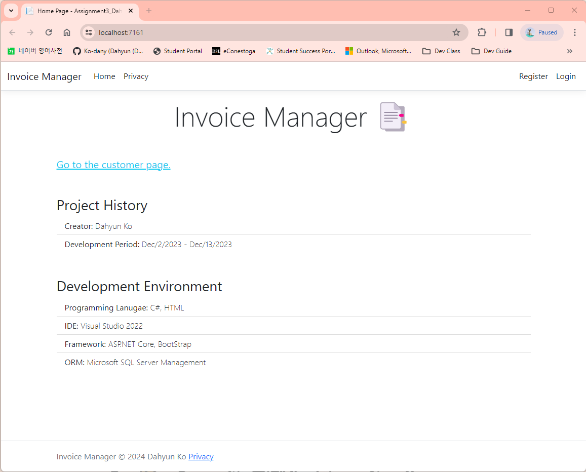
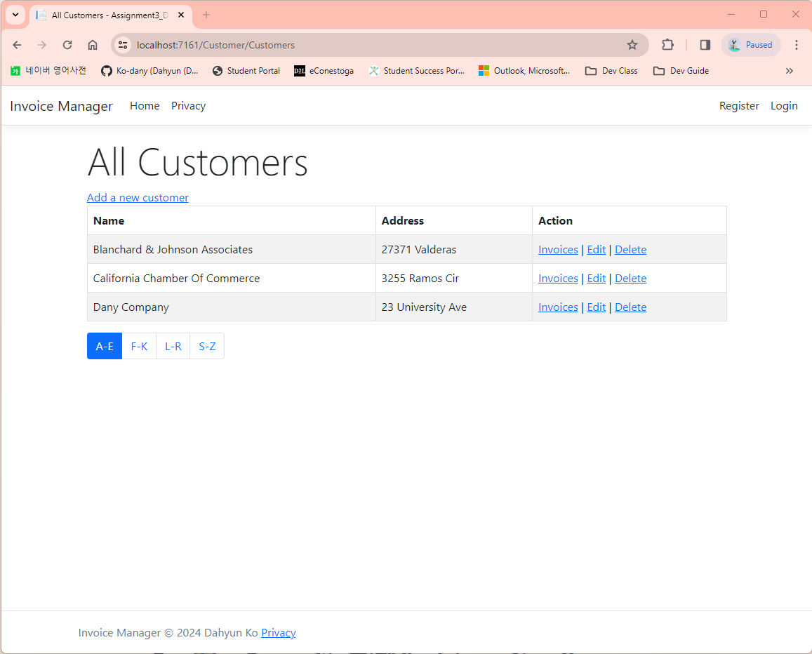
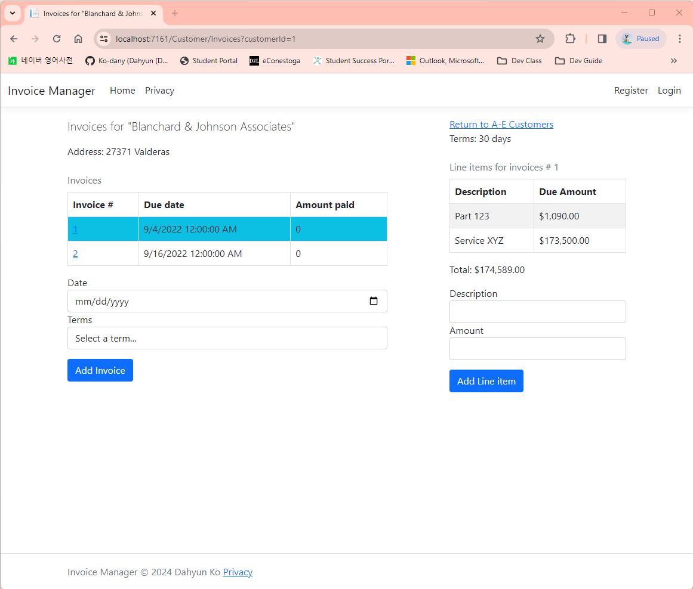
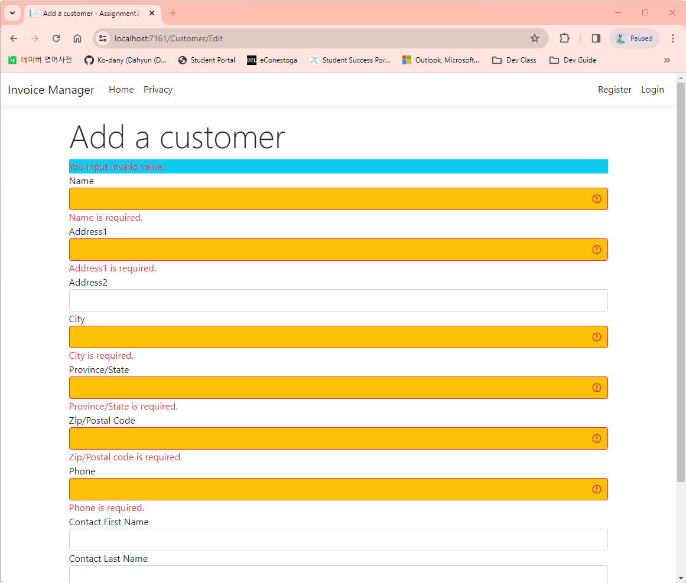
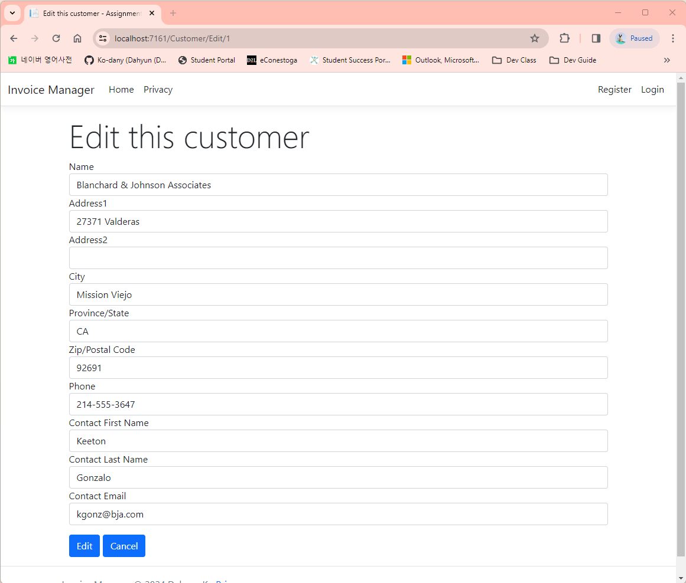
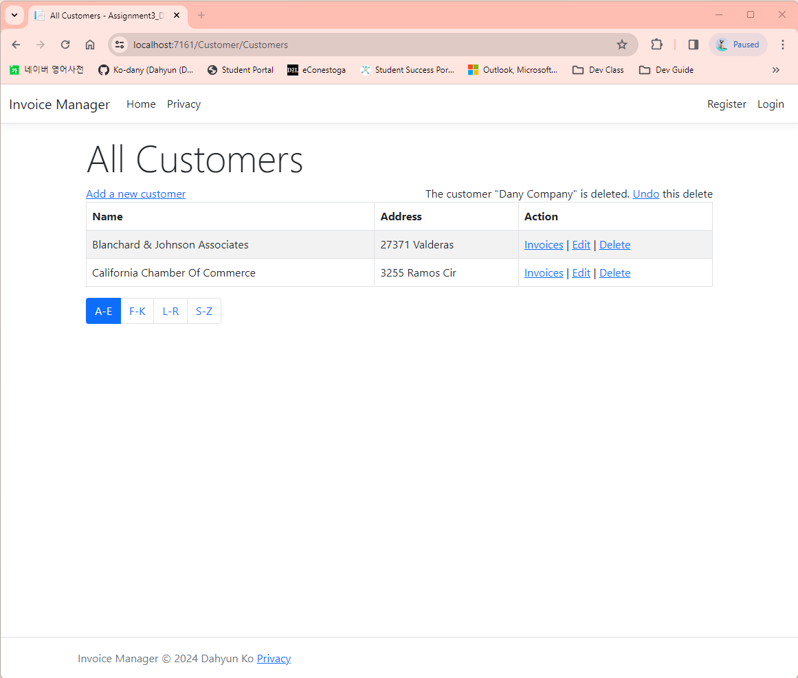

# ASP.NET\_\_Invoice_Manager 📑

**Invoice Manager** is a web application developed using ASP.NET Core, incorporating Bootstrap for enhanced user interface. This app lets users sign up, log in, and easily handle invoices and line items.

## Project History

- **Creator:** Dahyun Ko
- **Development Period:** Dec/11/2023 - Dec/13/2023

## Development Environment

- **Programming Language:** `C#`, `HTML`
- **IDE:** `Visual Studio 2022`
- **Framework:** `ASP.NET Core`, `Bootstrap`, `xUnit Test`
- **ORM:** `Microsoft SQL Server Management`

## Main Features

- Create/Read/Update/Delete
- SQL DB Establishement & Connection
- Data Validation
- Alphabetical Grouping of the List
- Soft Deletion
- Unit Testing

<!-- ### (Feature for future)

- Cookie & Session
- Authentication
- Authorization -->

<!-- ## How to start -->

<!-- Add instructions on how to get the project up and running -->

<!DOCTYPE html>
<html lang="en">
<head>
  <meta charset="UTF-8">
  <meta name="viewport" content="width=device-width, initial-scale=1.0">
  <title>Bootstrap in Markdown</title>
</head>
<body>

<!-- 내용 작성 -->

## Preview

